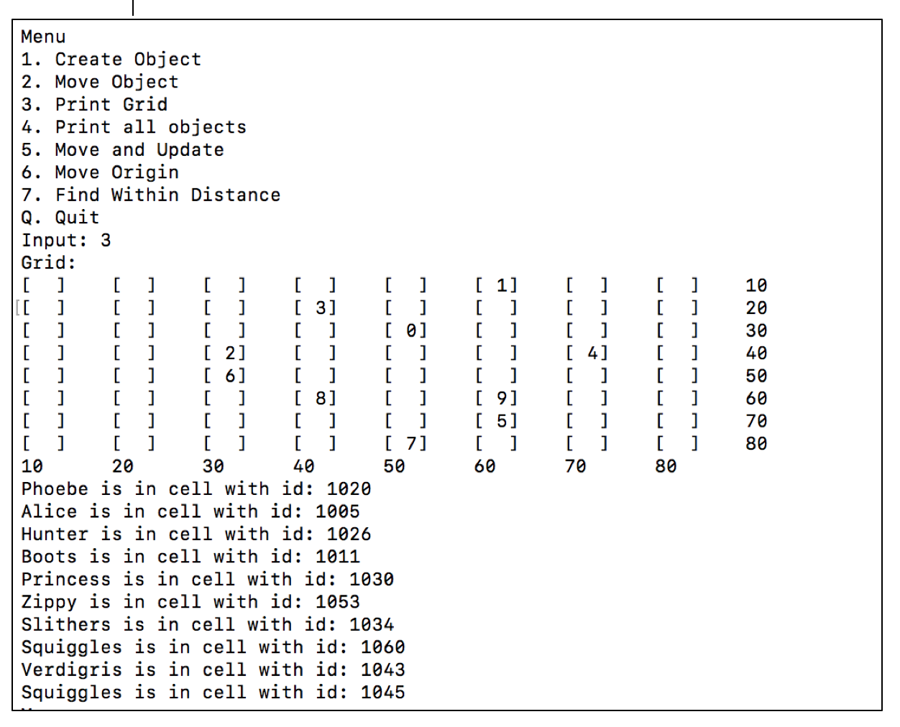
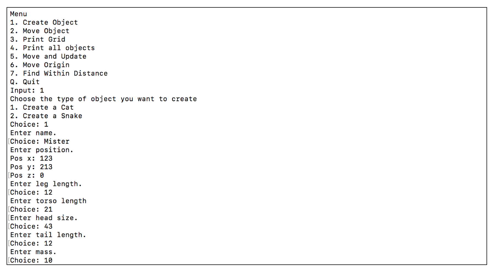
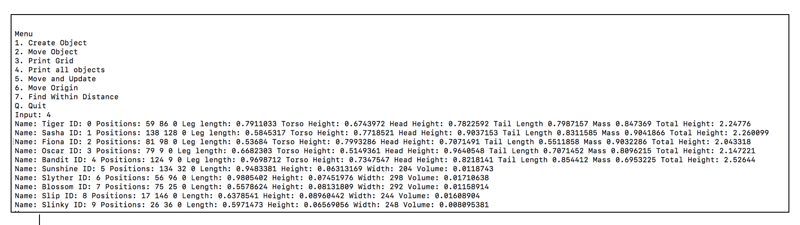

# Mobile objects on a 2D array of cells

Mobile objects with randomly generated positions and properties on a grid.  

Users can create new objects and move them on the grid.

Each cell keeps track of all the objects in its location, the list of objects in each cell is orted by z value.  

